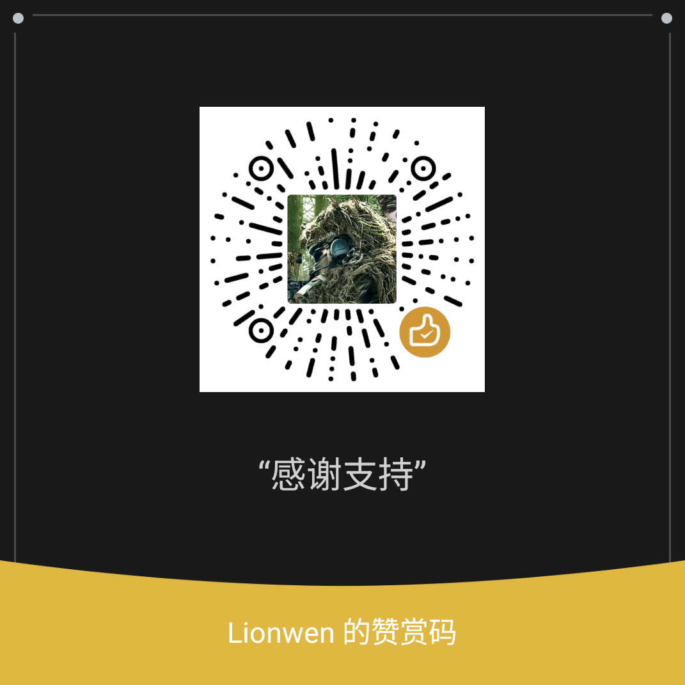

# Bot Assistant

**A self-hosted Windows control desk for AstrBot and NapCat QQ bots.** Manage several QQ accounts, recover one disconnected account at a time, configure your own model and voice services, and inspect the AstrBot project from a single desktop app.

[中文说明](README.md) · [Deployment](#deployment-modes) · [Quick start](#quick-start) · [Validation](#validation) · [License](COPYRIGHT.md) · [Support](#support-the-project)

> **Version 0.7.1 is a prerelease.** An isolated Windows project has started the downloaded components and generated a login QR code. Real QQ login, message exchange, and simultaneous multi-account operation in a fresh native installation still need independent testing.

## Features

| Feature | What it does |
| --- | --- |
| Guided setup | Choose native Windows without Docker, local Docker, or remote SSH. Official dependencies are downloaded on first use. |
| Multiple QQ accounts | Separate NapCat data per account, dynamic account cards, avatar, status, QR code, rename, and targeted recovery. |
| Bot configuration | Use your own model API, persona, optional speech recognition, and optional voice replies. |
| Reasoning effort | For supported DeepSeek models, set `none`, `low`, `high`, or `max` per QQ account. AstrBot admins can use short natural-language commands in chat. |
| Project operations | Inspect services, logs, backups, safe configuration previews, and the plugin list; open the AstrBot dashboard. |

## Deployment modes

| Mode | Requirements | OneBot connection |
| --- | --- | --- |
| Native Windows | An empty project folder, your own model API, and internet access for the first download. No Docker, SSH, or Python installation is required to run the EXE. | Configured by the setup wizard; real multi-account chat remains unverified. |
| Local Docker | Docker Desktop running Linux containers. | Configure one platform per account in AstrBot; see [Docker connection](docs/DOCKER_CONNECT.md). |
| Remote SSH | Your own Linux server, SSH key, Python 3.9+, Docker Engine, and Compose. | Configure OneBot for new projects or [adopt existing containers](docs/ADOPT_EXISTING.md). |

No personal API keys, QQ login data, or cloud accounts are included in this repository or its release package.
The [pre-publication privacy audit](docs/PUBLIC_RELEASE_AUDIT.md) records the checked scope and the intentionally public donation QR code.

## Quick start

1. Download the newest successful `BotAssistant-win64` artifact from **Actions → Windows build**, extract it, and run `BotAssistant.exe`. Or build from source as shown below.
2. Select a connection mode. For native Windows, choose a new empty folder and supply your own model API, dashboard password, and optional persona or voice settings.
3. Add a QQ account, open its QR code, and confirm the login in the mobile QQ app.
4. Use that account's QR action if it disconnects. The app checks status and code freshness and does not restart an account whose state is unknown.
5. Open **Project operations** for logs and backups, or **Bot settings** for model, voice, persona, and reasoning controls.

Run `Install-BotAssistant-Desktop.ps1` from the ZIP if you want a desktop shortcut. It retains existing connection settings. See [native Windows setup](NATIVE_SETUP.md) for detailed setup and troubleshooting.

## Reasoning effort

In **Bot settings → Reasoning effort**, enable the component once, select a QQ platform, then save its level. Initial activation briefly restarts AstrBot but leaves NapCat running. The setting applies from that account's next message.

The control currently supports `deepseek-flash` and `deepseek-v4-pro`. `high` is the default. AstrBot admins may say phrases such as “把思考强度调低”, “把思考强度调到最高”, “关闭思考”, or “现在思考强度是多少” in the corresponding QQ chat. These commands are handled locally without a model request. Regular members cannot change settings. See the [DeepSeek thinking-mode reference](https://api-docs.deepseek.com/guides/thinking_mode/).

## Validation

| Area | Current evidence |
| --- | --- |
| Tests and Windows executable | 42 automated tests and the packaged resource self-check passed locally. |
| Existing cloud project | Two adopted accounts, service status, role isolation, and per-account reasoning state were checked. |
| Admin chat command | Parsing and permission tests passed; a real QQ message has not yet been exercised. |
| Fresh native setup | Component startup and QR generation passed; real QQ login, replies, and concurrent accounts remain to be tested. |

These checks do not establish compatibility with every Windows, QQ, or model-service configuration.

## Build

```powershell
python -m unittest discover -s tests -v
./scripts/build.ps1
```

The build produces `release/BotAssistant.exe` and a versioned Windows ZIP. It also collects the Python, Tcl/Tk, and Pillow license texts from the build environment for the ZIP. `python run.pyw --demo` displays example account cards without contacting a real server or QQ account.

## License and third-party components

Thanks to the maintainers of [AstrBot](https://github.com/AstrBotDevs/AstrBot), [AstrBot Desktop](https://github.com/AstrBotDevs/AstrBot-desktop), [NapCatQQ](https://github.com/NapNeko/NapCatQQ), [NapCat-Docker](https://github.com/NapNeko/NapCat-Docker), and the [OneBot v11](https://github.com/botuniverse/onebot-11) community. See the [upstream attribution and third-party license inventory](THIRD_PARTY.md) for each project's role, provenance, and terms.

Bot Assistant 0.7.1 and later original code and documentation use the [PolyForm Noncommercial License 1.0.0](LICENSE). This is source-available, **not OSI-approved open source**. Copies previously distributed under MIT retain their existing MIT permissions. See [copyright and infringement reports](COPYRIGHT.md). AstrBot, NapCat, QQ, and Docker are not relicensed or redistributed by this project; packaged Python, Tcl/Tk, and Pillow components retain their own licenses.

## Support the project

Noncommercial use does not require a donation. If this project helps you, a GitHub Star or a voluntary donation to Lionwen is welcome. A donation is not a commercial-use license.

<a href="docs/media/support-lionwen.png"></a>

[Open the full-size donation QR code](docs/media/support-lionwen.png)
